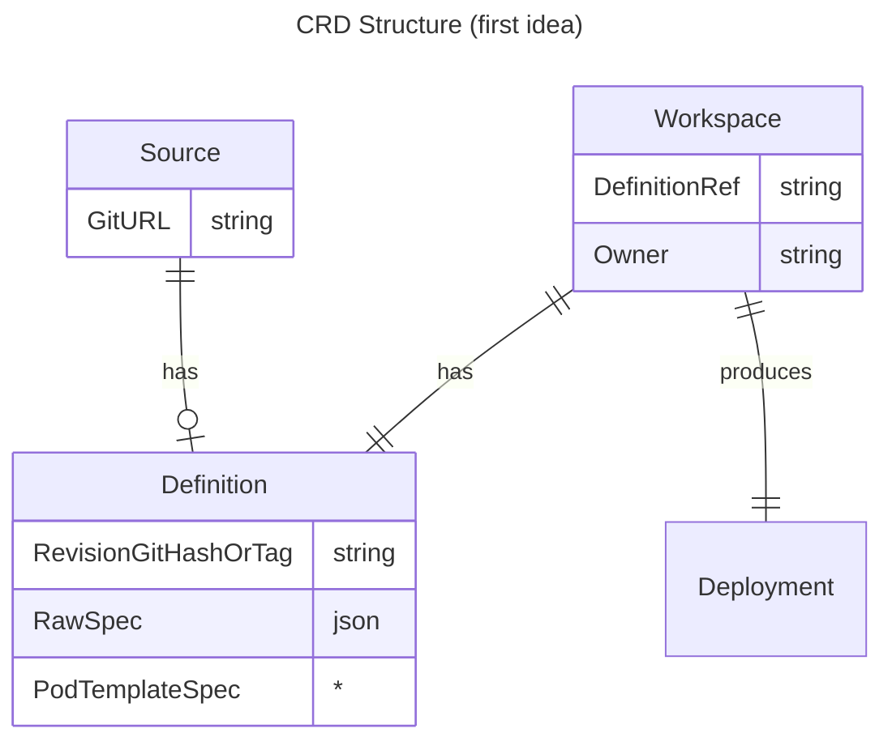
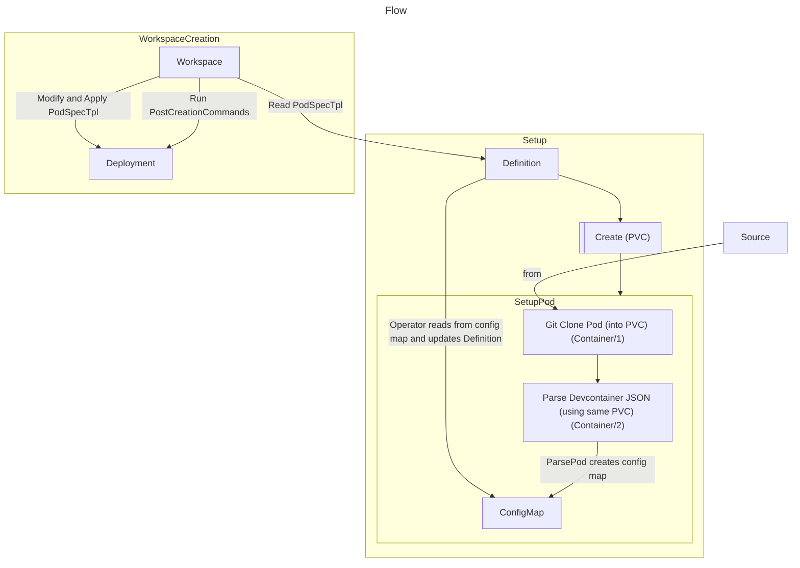

# devcontainer-light controller

## Description
This controller provisions devcontainer-light pods on demand.

devcontainer-light means it does not support the full devcontainer spec and feature set.
What the controller essentially provides is the most essential features of the spec,
like a pod provisioned with the given image and PostCreateCommand and the specified ports exposed at the containter
level.

Using `features` from the spec is not supported.
Using a Dockerfile is currently also not supported, you have to pre-build your images.
The repository that owns the .devcontainer will _always_ be mounted at `/workspace`.






## Getting Started

**NOTE:** Parts of the README are still from the kubebuilder boilerplate keep this in mind.

### Prerequisites
- go version v1.22.0+
- docker version 17.03+.
- kubectl version v1.11.3+.
- Access to a Kubernetes v1.11.3+ cluster.

If you are running this locally using kind: run `make build-and-push-utilities` before you attempt to create any resources.
If you are running this locally not using kind: run `make build-utilities`, you then need to make sure that the resulting two images are put somewhere where the cluster can pull it from.
Currently you might need to even adjust the code that defines the images if you want to pull it from a specific registry, otherwise it might try to pull it from dockerhub.
This is very alpha and will be configurable in the future

### To Deploy on the cluster
**Build and push your image to the location specified by `IMG`:**

```sh
make docker-build docker-push IMG=<some-registry>/devcontainer:tag
```

**NOTE:** This image ought to be published in the personal registry you specified.
And it is required to have access to pull the image from the working environment.
Make sure you have the proper permission to the registry if the above commands don’t work.

**Install the CRDs into the cluster:**

```sh
make install
```

**Deploy the Manager to the cluster with the image specified by `IMG`:**

```sh
make deploy IMG=<some-registry>/devcontainer:tag
```

> **NOTE**: If you encounter RBAC errors, you may need to grant yourself cluster-admin
privileges or be logged in as admin.

**Create instances of your solution**
You can apply the samples (examples) from the config/sample:

Currently this will create two sources, with each having one definition and each one workspace.
The final result should be each workspace having a deployment with one pod that you can exec into / attach VSCode to.

```sh
kubectl apply -k config/samples/
```

>**NOTE**: Ensure that the samples has default values to test it out.

### To Uninstall
**Delete the instances (CRs) from the cluster:**

```sh
kubectl delete -k config/samples/
```

**Delete the APIs(CRDs) from the cluster:**

```sh
make uninstall
```

**UnDeploy the controller from the cluster:**

```sh
make undeploy
```

## Project Distribution

Following are the steps to build the installer and distribute this project to users.

1. Build the installer for the image built and published in the registry:

```sh
make build-installer IMG=<some-registry>/devcontainer:tag
```

NOTE: The makefile target mentioned above generates an 'install.yaml'
file in the dist directory. This file contains all the resources built
with Kustomize, which are necessary to install this project without
its dependencies.

2. Using the installer

Users can just run kubectl apply -f <URL for YAML BUNDLE> to install the project, i.e.:

```sh
kubectl apply -f https://raw.githubusercontent.com/<org>/devcontainer/<tag or branch>/dist/install.yaml
```

## Contributing
// TODO(user): Add detailed information on how you would like others to contribute to this project

**NOTE:** Run `make help` for more information on all potential `make` targets

More information can be found via the [Kubebuilder Documentation](https://book.kubebuilder.io/introduction.html)

## License

**TODO: Update this section**

Copyright 2025.

Licensed under the Apache License, Version 2.0 (the "License");
you may not use this file except in compliance with the License.
You may obtain a copy of the License at

    http://www.apache.org/licenses/LICENSE-2.0

Unless required by applicable law or agreed to in writing, software
distributed under the License is distributed on an "AS IS" BASIS,
WITHOUT WARRANTIES OR CONDITIONS OF ANY KIND, either express or implied.
See the License for the specific language governing permissions and
limitations under the License.

